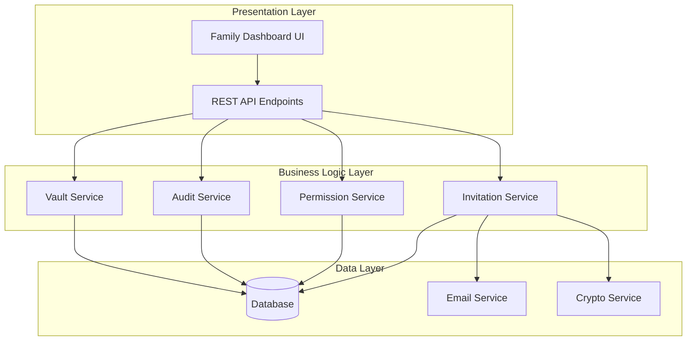

# Design Document: Family Vault Sharing

## Overview

The Family Vault Sharing feature enables InsureScan users to securely share their insurance policy vault with trusted family members. The system provides a secure invitation mechanism, granular permission controls, comprehensive audit logging, and read-only access to shared policies. The design prioritizes security, user experience, and data integrity while maintaining clear separation between vault owners and family members.

## Architecture

The family sharing system follows a multi-layered architecture with clear separation of concerns:



**Key Architectural Principles:**
- **Security First**: All family member access is read-only with encrypted tokens
- **Audit Everything**: Comprehensive logging of all access and permission changes
- **Granular Control**: Vault owners have complete control over what is shared
- **Scalable Design**: Supports multiple family members per vault with different permissions

## Components and Interfaces

### Invitation Service

Handles the secure invitation and verification process for family members.

```typescript
interface InvitationService {
  // Send invitation to family member
  sendInvitation(vaultOwnerId: string, email: string, permissions: PermissionLevel): Promise<Invitation>
  
  // Verify invitation token and activate family member access
  verifyInvitation(token: string): Promise<FamilyMember>
  
  // Resend invitation if not yet accepted
  resendInvitation(invitationId: string): Promise<void>
  
  // Revoke pending invitation
  revokeInvitation(invitationId: string): Promise<void>
  
  // Get all invitations for a vault owner
  getInvitations(vaultOwnerId: string): Promise<Invitation[]>
}
```

### Permission Service

Manages access control and permission enforcement for family members.

```typescript
interface PermissionService {
  // Set permissions for a family member
  setPermissions(familyMemberId: string, permissions: PermissionLevel): Promise<void>
  
  // Check if family member can access specific policy
  canAccessPolicy(familyMemberId: string, policyId: string): Promise<boolean>
  
  // Get all policies accessible to family member
  getAccessiblePolicies(familyMemberId: string): Promise<string[]>
  
  // Update specific policy permissions
  updatePolicyPermissions(familyMemberId: string, policyIds: string[]): Promise<void>
  
  // Remove all access for family member
  revokeAccess(familyMemberId: string): Promise<void>
}
```

### Vault Service

Provides read-only access to shared insurance policies for family members.

```typescript
interface VaultService {
  // Get shared policies for family member (filtered by permissions)
  getSharedPolicies(familyMemberId: string): Promise<PolicySummary[]>
  
  // Get detailed view of specific policy (if permitted)
  getPolicyDetails(familyMemberId: string, policyId: string): Promise<PolicyDetails>
  
  // Search shared policies
  searchPolicies(familyMemberId: string, query: string): Promise<PolicySummary[]>
  
  // Get policy document (if permitted)
  getPolicyDocument(familyMemberId: string, policyId: string): Promise<Document>
}
```

### Audit Service

Tracks all access activities and permission changes for security and compliance.

```typescript
interface AuditService {
  // Log family member access to policy
  logPolicyAccess(familyMemberId: string, policyId: string, accessType: AccessType): Promise<void>
  
  // Log permission changes
  logPermissionChange(vaultOwnerId: string, familyMemberId: string, oldPermissions: PermissionLevel, newPermissions: PermissionLevel): Promise<void>
  
  // Log invitation activities
  logInvitationActivity(vaultOwnerId: string, email: string, activity: InvitationActivity): Promise<void>
  
  // Get audit trail for vault owner
  getAuditTrail(vaultOwnerId: string, filters?: AuditFilters): Promise<AuditEntry[]>
  
  // Detect suspicious access patterns
  detectSuspiciousActivity(vaultOwnerId: string): Promise<SecurityAlert[]>
}
```

## Data Models

### Core Entities

```typescript
// Invitation entity for managing family member invitations
interface Invitation {
  id: string
  vaultOwnerId: string
  email: string
  permissions: PermissionLevel
  token: string
  status: InvitationStatus
  createdAt: Date
  expiresAt: Date
  acceptedAt?: Date
}

// Family member entity after invitation acceptance
interface FamilyMember {
  id: string
  vaultOwnerId: string
  email: string
  permissions: PermissionLevel
  specificPolicyIds?: string[]  // Only set when permissions = 'specific'
  status: FamilyMemberStatus
  createdAt: Date
  lastAccessAt?: Date
}

// Permission levels for family members
type PermissionLevel = 'view_all' | 'view_specific'

// Invitation status tracking
type InvitationStatus = 'pending' | 'accepted' | 'expired' | 'revoked'

// Family member status
type FamilyMemberStatus = 'active' | 'suspended' | 'revoked'
```

### Policy Access Models

```typescript
// Simplified policy summary for family member view
interface PolicySummary {
  id: string
  type: string
  provider: string
  policyNumber: string
  coverageAmount: number
  premium: number
  expirationDate: Date
  status: string
}

// Detailed policy information (filtered for family members)
interface PolicyDetails {
  id: string
  type: string
  provider: string
  policyNumber: string
  coverageAmount: number
  deductible: number
  premium: number
  expirationDate: Date
  status: string
  keyBenefits: string[]
  contactInfo: ContactInfo
  // Sensitive fields like SSN, account numbers are excluded
}
```

### Audit Models

```typescript
// Audit trail entry
interface AuditEntry {
  id: string
  vaultOwnerId: string
  familyMemberId?: string
  activity: AuditActivity
  details: Record<string, any>
  timestamp: Date
  ipAddress: string
  userAgent: string
}

// Types of auditable activities
type AuditActivity = 
  | 'invitation_sent'
  | 'invitation_accepted'
  | 'invitation_revoked'
  | 'policy_accessed'
  | 'permissions_changed'
  | 'access_revoked'
  | 'suspicious_activity_detected'

// Security alert for suspicious activities
interface SecurityAlert {
  id: string
  vaultOwnerId: string
  familyMemberId: string
  alertType: SecurityAlertType
  description: string
  severity: 'low' | 'medium' | 'high'
  timestamp: Date
  resolved: boolean
}

type SecurityAlertType = 
  | 'unusual_access_pattern'
  | 'multiple_failed_attempts'
  | 'access_from_new_location'
  | 'bulk_policy_access'
```

## Correctness Properties

*A property is a characteristic or behavior that should hold true across all valid executions of a system—essentially, a formal statement about what the system should do. Properties serve as the bridge between human-readable specifications and machine-verifiable correctness guarantees.*

Let me analyze the acceptance criteria to determine which ones can be tested as properties.

### Property 1: Invitation Token Uniqueness and Security
*For any* set of invitations created by the system, all verification tokens should be cryptographically unique and properly formatted with expiration timestamps within 48 hours.
**Validates: Requirements 4.1, 4.2**

### Property 2: Token Verification Round Trip
*For any* valid invitation token, verifying the token should successfully activate family member access with the correct permissions, and invalid/expired tokens should be rejected with proper logging.
**Validates: Requirements 4.3, 4.4**

### Property 3: Permission Enforcement Invariant
*For any* family member and policy combination, access should be granted if and only if the family member has explicit permission to view that policy (either through 'view_all' or specific policy inclusion).
**Validates: Requirements 2.3, 2.5, 3.1**

### Property 4: Read-Only Access Enforcement
*For any* family member operation, all modification attempts on policy data should be rejected while read operations on permitted policies should succeed.
**Validates: Requirements 3.1, 3.2**

### Property 5: Invitation State Consistency
*For any* invitation, the system should maintain consistent state transitions (pending → accepted/expired/revoked) with proper notifications and audit logging.
**Validates: Requirements 1.2, 1.4, 1.5**

### Property 6: Permission Update Propagation
*For any* permission change made by a vault owner, the new permissions should be immediately enforced for all subsequent family member access attempts and properly logged.
**Validates: Requirements 2.4, 5.4**

### Property 7: Comprehensive Audit Logging
*For any* system activity (policy access, permission changes, invitations), complete audit entries should be created with timestamp, actor identity, and activity details.
**Validates: Requirements 6.1, 6.2**

### Property 8: Dashboard Data Consistency
*For any* vault owner's dashboard view, displayed information should accurately reflect the current state of all family members, invitations, and recent activities.
**Validates: Requirements 5.1, 5.2, 5.5**

### Property 9: Policy Presentation Completeness
*For any* shared policy displayed to family members, the formatted view should include all critical information (coverage amounts, deductibles, policy numbers, expiration dates) in a standardized format.
**Validates: Requirements 7.1, 7.2, 7.4**

### Property 10: Session Security Management
*For any* family member session, authentication tokens should have limited validity periods and inactive sessions should be automatically terminated after timeout.
**Validates: Requirements 3.4, 3.5**

## Error Handling

The system implements comprehensive error handling across all components:

### Invitation Errors
- **Invalid Email Format**: Reject invitation with clear error message
- **Duplicate Invitations**: Prevent multiple pending invitations to same email
- **Expired Tokens**: Gracefully handle expired verification attempts
- **Network Failures**: Retry email delivery with exponential backoff

### Permission Errors  
- **Unauthorized Access**: Return 403 Forbidden with audit logging
- **Invalid Permission Levels**: Validate permission types at API boundary
- **Concurrent Updates**: Handle race conditions in permission changes
- **Orphaned Permissions**: Clean up permissions when policies are deleted

### Data Integrity Errors
- **Malformed Policy Data**: Validate policy structure before display
- **Missing Required Fields**: Handle incomplete policy information gracefully
- **Database Constraints**: Ensure referential integrity between entities
- **Audit Log Failures**: Never fail operations due to audit logging issues

### Security Errors
- **Token Tampering**: Detect and reject modified verification tokens
- **Session Hijacking**: Validate session tokens and IP addresses
- **Brute Force Attempts**: Rate limit verification attempts
- **Suspicious Patterns**: Alert vault owners of unusual access behavior

## Testing Strategy

The family vault sharing system requires comprehensive testing using both unit tests and property-based tests to ensure security, correctness, and reliability.

### Property-Based Testing

Property-based tests validate universal correctness properties across all possible inputs using a property testing library. Each test should run a minimum of 100 iterations to ensure comprehensive coverage.

**Configuration Requirements:**
- Use a property-based testing library appropriate for the implementation language
- Configure each test to run minimum 100 iterations due to randomization
- Tag each test with format: **Feature: family-vault-sharing, Property {number}: {property_text}**
- Each correctness property must be implemented by a single property-based test

**Property Test Coverage:**
- **Security Properties**: Permission enforcement, access control, token validation
- **Data Integrity**: Read-only access, audit logging, state consistency  
- **Business Logic**: Invitation workflows, permission management, policy sharing
- **User Interface**: Dashboard accuracy, policy presentation, search functionality

### Unit Testing

Unit tests complement property-based tests by focusing on specific examples, edge cases, and integration points.

**Unit Test Focus Areas:**
- **Specific Examples**: Test concrete scenarios with known inputs/outputs
- **Edge Cases**: Empty policy lists, expired invitations, invalid tokens
- **Error Conditions**: Network failures, malformed data, unauthorized access
- **Integration Points**: Email service integration, database transactions, API endpoints

**Testing Balance:**
- Property tests handle comprehensive input coverage through randomization
- Unit tests verify specific behaviors and catch concrete implementation bugs
- Both approaches are necessary for complete coverage and confidence

### Security Testing

Given the sensitive nature of insurance data, security testing is paramount:

- **Authentication Testing**: Verify token generation, validation, and expiration
- **Authorization Testing**: Ensure permission enforcement across all access paths
- **Input Validation**: Test all API endpoints with malicious and malformed inputs
- **Audit Trail Testing**: Verify complete logging of all security-relevant events
- **Session Management**: Test timeout behavior and session invalidation
