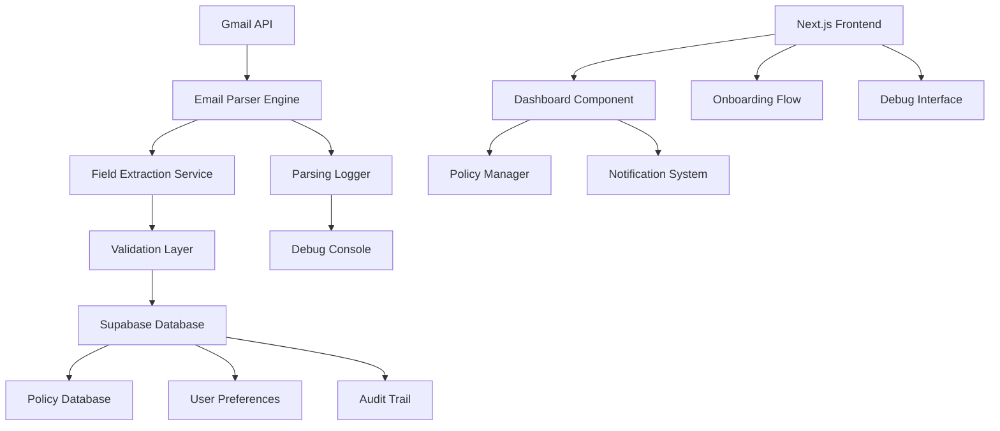

# Design Document: Insurance Scanner UX Improvements

## Overview

This design addresses critical UX gaps in an existing Next.js insurance scanner application that integrates with Gmail API and Supabase. The primary focus is fixing the core email parsing functionality before implementing comprehensive UX improvements. The application currently suffers from unreliable field extraction, limiting its effectiveness as an insurance policy management tool.

The design follows a phased approach: first establishing robust email parsing with debugging capabilities, then building enhanced user experiences on this solid foundation. The solution leverages modern web technologies while maintaining compatibility with the existing Next.js/Supabase/Gmail API stack.

## Architecture

### System Components



### Core Architecture Principles

1. **Separation of Concerns**: Email parsing, UI components, and data management are isolated
2. **Debugging First**: All parsing operations include comprehensive logging and debugging
3. **Progressive Enhancement**: Core functionality works before advanced features are added
4. **Scalable Parsing**: Single email debugging scales to batch processing
5. **User-Centric Design**: Every feature addresses specific user pain points

## Components and Interfaces

### Email Parser Engine

**Purpose**: Core service responsible for extracting structured data from insurance emails

**Key Methods**:
```typescript
interface EmailParserEngine {
  parseSingleEmail(emailContent: string, debugMode: boolean): ParseResult
  parseBatchEmails(emails: EmailContent[], options: BatchOptions): BatchResult
  validateParsedData(data: ParsedFields): ValidationResult
  getParsingPatterns(): ParsingPattern[]
}

interface ParseResult {
  success: boolean
  extractedFields: ParsedFields
  debugInfo: DebugInfo
  confidence: number
  errors: ParseError[]
}
```

**Parsing Strategy**:
- Multi-pattern approach using regex, keyword matching, and contextual analysis
- Currency detection with international format support
- Date parsing with multiple format recognition
- Company name extraction using known insurer databases
- Policy number identification through pattern recognition

### Field Extraction Service

**Purpose**: Specialized extractors for each insurance field type

**Extractors**:
1. **Premium Amount Extractor**: Handles currency symbols, decimal formats, and amount ranges
2. **Due Date Extractor**: Processes various date formats and relative date expressions
3. **Company Name Extractor**: Matches against known insurers and extracts from email headers
4. **Policy Number Extractor**: Identifies alphanumeric policy identifiers
5. **Policy Holder Extractor**: Extracts names from email content and headers

**Pattern Examples**:
```typescript
const PREMIUM_PATTERNS = [
  /\$[\d,]+\.?\d{0,2}/g,                    // $1,234.56
  /premium.*?(\$[\d,]+\.?\d{0,2})/gi,       // Premium: $1,234.56
  /amount.*?(\$[\d,]+\.?\d{0,2})/gi,        // Amount due: $1,234.56
  /total.*?(\$[\d,]+\.?\d{0,2})/gi          // Total: $1,234.56
];

const DATE_PATTERNS = [
  /\d{1,2}\/\d{1,2}\/\d{4}/g,               // MM/DD/YYYY
  /\d{4}-\d{2}-\d{2}/g,                     // YYYY-MM-DD
  /\b\w+\s+\d{1,2},\s+\d{4}\b/g           // January 15, 2024
];
```

### Debug Interface Component

**Purpose**: Provides detailed parsing analysis for single email testing

**Features**:
- Raw email content display with syntax highlighting
- Step-by-step parsing process visualization
- Pattern matching results with confidence scores
- Field extraction comparison table
- Error highlighting and suggestions
- Export functionality for debugging data

**Interface Design**:
```typescript
interface DebugInterface {
  displayRawEmail(content: string): void
  showParsingSteps(steps: ParsingStep[]): void
  highlightMatches(patterns: PatternMatch[]): void
  compareResults(expected: ParsedFields, actual: ParsedFields): void
  exportDebugData(): DebugExport
}
```

### Enhanced Dashboard Component

**Purpose**: Main user interface for policy management and scanning

**Key Features**:
- Policy overview with status indicators
- Quick scan functionality with progress tracking
- Filtering and search capabilities
- Bulk action support
- Mobile-responsive design

**State Management**:
```typescript
interface DashboardState {
  policies: PolicyRecord[]
  scanStatus: ScanStatus
  filters: FilterOptions
  selectedPolicies: string[]
  notifications: Notification[]
}
```

### Onboarding Flow Component

**Purpose**: Guides new users through initial setup and first scan

**Flow Steps**:
1. Welcome and value proposition
2. Gmail permission explanation and setup
3. First scan walkthrough with live guidance
4. Results interpretation and dashboard tour
5. Feature overview and next steps

**Progress Tracking**:
```typescript
interface OnboardingProgress {
  currentStep: number
  completedSteps: string[]
  userPreferences: UserPreferences
  skipRequested: boolean
}
```

## Data Models

### Core Data Structures

```typescript
interface PolicyRecord {
  id: string
  userId: string
  insurerName: string
  policyNumber?: string
  premiumAmount: number
  currency: string
  dueDate: Date
  status: PolicyStatus
  extractionConfidence: number
  sourceEmailId: string
  createdAt: Date
  updatedAt: Date
  debugData?: DebugInfo
}

interface ParsedFields {
  insurerName?: string
  policyNumber?: string
  premiumAmount?: number
  currency?: string
  dueDate?: Date
  policyHolder?: string
  confidence: FieldConfidence
}

interface FieldConfidence {
  insurerName: number
  policyNumber: number
  premiumAmount: number
  dueDate: number
  overall: number
}

interface DebugInfo {
  emailContent: string
  parsingSteps: ParsingStep[]
  patternMatches: PatternMatch[]
  extractionAttempts: ExtractionAttempt[]
  errors: ParseError[]
  timestamp: Date
}
```

### Database Schema Extensions

**New Tables**:
```sql
-- Parsing debug information
CREATE TABLE parsing_debug (
  id UUID PRIMARY KEY DEFAULT gen_random_uuid(),
  policy_id UUID REFERENCES insurance_premiums(id),
  email_content TEXT,
  parsing_steps JSONB,
  pattern_matches JSONB,
  errors JSONB,
  created_at TIMESTAMP DEFAULT NOW()
);

-- User onboarding progress
CREATE TABLE user_onboarding (
  user_id UUID PRIMARY KEY REFERENCES users(id),
  completed_steps TEXT[],
  current_step INTEGER DEFAULT 1,
  preferences JSONB,
  completed_at TIMESTAMP
);

-- Notification preferences
CREATE TABLE notification_settings (
  user_id UUID PRIMARY KEY REFERENCES users(id),
  email_reminders BOOLEAN DEFAULT true,
  days_before_due INTEGER DEFAULT 7,
  urgent_days_before INTEGER DEFAULT 1,
  notification_types TEXT[]
);
```

## Correctness Properties

*A property is a characteristic or behavior that should hold true across all valid executions of a system—essentially, a formal statement about what the system should do. Properties serve as the bridge between human-readable specifications and machine-verifiable correctness guarantees.*

Let me analyze the acceptance criteria to determine which are testable as properties:
### Property Reflection

After analyzing all acceptance criteria, I identified several areas where properties can be consolidated:

**Consolidation Opportunities:**
- Properties 1.1-1.5 (field extraction) can be combined into a comprehensive extraction property
- Properties 1.6-1.7 (logging) can be combined into a single logging property  
- Properties 2.2-2.6 (debug interface) can be combined into a comprehensive debug display property
- Properties 4.4-4.5 (filtering) can be combined into a single filtering property

**Final Properties:**

Property 1: Comprehensive field extraction
*For any* insurance email containing policy information, the system should extract all available fields (policy holder, premium amount, due date, company name, policy number) with appropriate confidence scores
**Validates: Requirements 1.1, 1.2, 1.3, 1.4, 1.5**

Property 2: Parsing error logging
*For any* email processing attempt, if parsing fails for any field, the system should log the specific error with email content and continue processing other fields
**Validates: Requirements 1.6, 1.7**

Property 3: Single email processing
*For any* single email scan request, the system should process exactly one email and provide complete debugging information including raw content, parsing steps, pattern matches, and field comparison
**Validates: Requirements 2.1, 2.2, 2.3, 2.4, 2.5, 2.6, 2.7**

Property 4: Onboarding state management
*For any* user completing the onboarding flow, the system should mark them as onboarded and skip the flow on subsequent visits while preserving their preferences
**Validates: Requirements 3.3, 3.4, 3.5**

Property 5: Batch processing with progress tracking
*For any* batch scan operation, the system should process all matching emails, display progress indicators, and provide comprehensive summaries upon completion
**Validates: Requirements 4.1, 4.2, 4.3, 4.6**

Property 6: Flexible filtering
*For any* scan operation with date range or insurer filters, the system should process only emails matching the specified criteria
**Validates: Requirements 4.4, 4.5**

## Error Handling

### Parsing Error Recovery

**Strategy**: Graceful degradation with comprehensive logging
- Continue processing when individual fields fail to extract
- Provide partial results with confidence indicators
- Log all failures for system improvement
- Offer manual correction interfaces for failed extractions

**Error Categories**:
1. **Field Extraction Errors**: Missing or malformed data in expected locations
2. **Format Recognition Errors**: Unknown date, currency, or policy number formats  
3. **Gmail API Errors**: Rate limiting, authentication, or connectivity issues
4. **Database Errors**: Connection failures or constraint violations
5. **Validation Errors**: Extracted data fails business rule validation

**Recovery Mechanisms**:
```typescript
interface ErrorRecovery {
  retryWithAlternativePatterns(field: string, content: string): ParseResult
  requestManualInput(field: string, suggestions: string[]): Promise<string>
  logForSystemImprovement(error: ParseError, context: string): void
  provideFallbackValue(field: string, confidence: number): any
}
```

### User Experience Error Handling

**Principles**:
- Never show technical error messages to end users
- Always provide actionable next steps
- Maintain user confidence through transparent communication
- Preserve user data during error recovery

**Error UI Patterns**:
- Inline validation with helpful suggestions
- Progress preservation during network interruptions
- Contextual help for common issues
- Escalation paths for complex problems

## Testing Strategy

### Dual Testing Approach

The testing strategy employs both unit tests and property-based tests to ensure comprehensive coverage:

**Unit Tests**: Focus on specific examples, edge cases, and integration points
- Test specific email formats from known insurers
- Verify error handling for malformed inputs
- Test UI component interactions and state management
- Validate database operations and API integrations

**Property-Based Tests**: Verify universal properties across all inputs
- Generate random email content with embedded insurance data
- Test parsing robustness across various formats and languages
- Verify system behavior under different load conditions
- Ensure data consistency across all operations

### Property-Based Testing Configuration

**Framework**: Fast-check for TypeScript/JavaScript property-based testing
**Configuration**: Minimum 100 iterations per property test
**Test Tagging**: Each property test references its design document property

**Example Property Test Structure**:
```typescript
// Feature: insurance-scanner-ux-improvements, Property 1: Comprehensive field extraction
describe('Email parsing properties', () => {
  it('should extract all available fields from any insurance email', () => {
    fc.assert(fc.property(
      fc.record({
        policyHolder: fc.string(),
        premiumAmount: fc.float({ min: 1, max: 10000 }),
        dueDate: fc.date(),
        insurerName: fc.constantFrom('Geico', 'State Farm', 'Allstate'),
        policyNumber: fc.string({ minLength: 5, maxLength: 20 })
      }),
      (testData) => {
        const email = generateInsuranceEmail(testData);
        const result = emailParser.parseSingleEmail(email, false);
        
        expect(result.success).toBe(true);
        expect(result.extractedFields.premiumAmount).toBeCloseTo(testData.premiumAmount, 2);
        expect(result.extractedFields.insurerName).toBe(testData.insurerName);
        // Additional assertions for other fields
      }
    ), { numRuns: 100 });
  });
});
```

### Integration Testing

**Gmail API Integration**: Mock Gmail responses for consistent testing
**Database Integration**: Use test database with realistic data volumes
**UI Integration**: End-to-end testing with Playwright or Cypress
**Performance Testing**: Load testing with realistic email volumes

### Testing Data Management

**Test Email Generation**: Create realistic insurance emails programmatically
**Mock Data**: Comprehensive mock datasets for various insurance companies
**Edge Case Coverage**: Specific tests for unusual formats and error conditions
**Regression Testing**: Automated tests for previously fixed parsing issues
