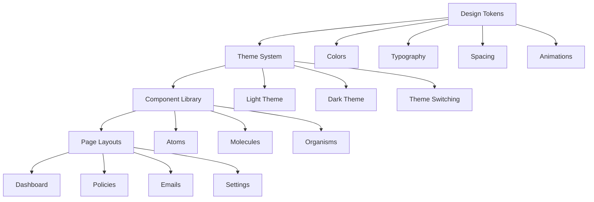
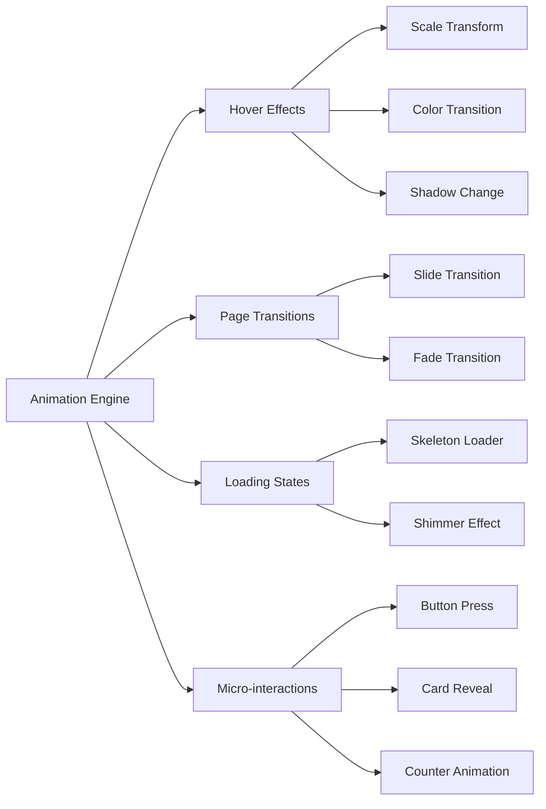

# Design Document: Premium Insurance Scanner UI

## Overview

This design transforms the existing Insurance Scanner into a premium, award-worthy interface that rivals the quality of Awwwards and Dribbble showcases. The design system emphasizes glassmorphism aesthetics, smooth micro-interactions, and modern visual hierarchy while maintaining all existing functionality.

The design draws inspiration from premium financial applications like CRED, Stripe, and HeyMarvin, focusing on creating an interface that users will want to screenshot and share. Every interaction is crafted to feel delightful and premium.

## Architecture

### Design System Architecture



### Component Hierarchy

The design follows atomic design principles:

**Atoms**: Button, Input, Badge, Icon, Typography
**Molecules**: Card, Form Field, Navigation Item, Search Bar
**Organisms**: Navigation Sidebar, Policy Grid, Dashboard Stats, Email List
**Templates**: Page Layout, Modal Layout, Form Layout
**Pages**: Dashboard, Policies, Emails, Settings

### Animation Architecture



## Components and Interfaces

### Core Design Tokens

```css
:root {
  /* Colors - Light Theme */
  --color-primary-50: #eff6ff;
  --color-primary-100: #dbeafe;
  --color-primary-500: #3b82f6;
  --color-primary-600: #2563eb;
  --color-primary-700: #1d4ed8;
  
  /* Glassmorphism */
  --glass-bg: rgba(255, 255, 255, 0.1);
  --glass-border: rgba(255, 255, 255, 0.2);
  --glass-blur: 20px;
  
  /* Shadows */
  --shadow-sm: 0 1px 2px 0 rgba(0, 0, 0, 0.05);
  --shadow-premium: 0 20px 25px -5px rgba(0, 0, 0, 0.1), 0 10px 10px -5px rgba(0, 0, 0, 0.04);
  --shadow-glow: 0 0 20px rgba(59, 130, 246, 0.3);
  
  /* Typography */
  --font-display: 'Inter', -apple-system, BlinkMacSystemFont, sans-serif;
  --font-body: 'Inter', -apple-system, BlinkMacSystemFont, sans-serif;
  --font-mono: 'JetBrains Mono', 'Fira Code', monospace;
  
  /* Spacing Scale */
  --space-1: 0.25rem;  /* 4px */
  --space-2: 0.5rem;   /* 8px */
  --space-3: 0.75rem;  /* 12px */
  --space-4: 1rem;     /* 16px */
  --space-6: 1.5rem;   /* 24px */
  --space-8: 2rem;     /* 32px */
  --space-12: 3rem;    /* 48px */
  --space-16: 4rem;    /* 64px */
  
  /* Animation Timing */
  --duration-fast: 150ms;
  --duration-normal: 250ms;
  --duration-slow: 350ms;
  --easing-smooth: cubic-bezier(0.4, 0, 0.2, 1);
  --easing-bounce: cubic-bezier(0.68, -0.55, 0.265, 1.55);
}

[data-theme="dark"] {
  --glass-bg: rgba(0, 0, 0, 0.2);
  --glass-border: rgba(255, 255, 255, 0.1);
  /* Additional dark theme overrides */
}
```

### Premium Card Component

```typescript
interface PremiumCardProps {
  variant?: 'default' | 'glass' | 'elevated';
  hover?: boolean;
  glow?: boolean;
  children: React.ReactNode;
  className?: string;
}

const PremiumCard: React.FC<PremiumCardProps> = ({
  variant = 'default',
  hover = true,
  glow = false,
  children,
  className
}) => {
  const baseClasses = `
    rounded-2xl border transition-all duration-300 ease-smooth
    ${hover ? 'hover:scale-[1.02] hover:shadow-premium' : ''}
    ${glow ? 'hover:shadow-glow' : ''}
  `;
  
  const variantClasses = {
    default: 'bg-white dark:bg-gray-800 border-gray-200 dark:border-gray-700',
    glass: 'bg-glass-bg backdrop-blur-glass-blur border-glass-border',
    elevated: 'bg-white dark:bg-gray-800 shadow-premium border-transparent'
  };
  
  return (
    <div className={`${baseClasses} ${variantClasses[variant]} ${className}`}>
      {children}
    </div>
  );
};
```

### Animation System

```typescript
// Animation utilities
export const animations = {
  // Hover effects
  scaleHover: 'hover:scale-105 transition-transform duration-fast ease-smooth',
  glowHover: 'hover:shadow-glow transition-shadow duration-normal',
  
  // Loading states
  shimmer: 'animate-pulse bg-gradient-to-r from-gray-200 via-gray-300 to-gray-200 bg-[length:200%_100%]',
  
  // Page transitions
  slideIn: 'animate-in slide-in-from-right-4 duration-normal',
  fadeIn: 'animate-in fade-in duration-normal',
  
  // Micro-interactions
  buttonPress: 'active:scale-95 transition-transform duration-75',
  counterUp: 'animate-in zoom-in duration-slow ease-bounce'
};

// Counter animation hook
export const useCounterAnimation = (end: number, duration: number = 2000) => {
  const [count, setCount] = useState(0);
  
  useEffect(() => {
    let startTime: number;
    const animate = (currentTime: number) => {
      if (!startTime) startTime = currentTime;
      const progress = Math.min((currentTime - startTime) / duration, 1);
      setCount(Math.floor(progress * end));
      
      if (progress < 1) {
        requestAnimationFrame(animate);
      }
    };
    
    requestAnimationFrame(animate);
  }, [end, duration]);
  
  return count;
};
```

### Navigation Design

```typescript
interface NavigationItem {
  label: string;
  href: string;
  icon: React.ComponentType;
  badge?: number;
}

const PremiumNavigation: React.FC = () => {
  const pathname = usePathname();
  
  return (
    <nav className="fixed left-0 top-0 h-full w-64 bg-glass-bg backdrop-blur-glass-blur border-r border-glass-border p-6">
      <div className="mb-8">
        <div className="flex items-center gap-3">
          <div className="w-10 h-10 bg-gradient-to-br from-primary-500 to-primary-600 rounded-xl flex items-center justify-center shadow-premium">
            <InsuranceIcon className="w-6 h-6 text-white" />
          </div>
          <span className="text-xl font-bold bg-gradient-to-r from-primary-600 to-primary-700 bg-clip-text text-transparent">
            InsureScan
          </span>
        </div>
      </div>
      
      <ul className="space-y-2">
        {navigationItems.map((item) => (
          <li key={item.href}>
            <Link
              href={item.href}
              className={`
                flex items-center gap-3 px-4 py-3 rounded-xl transition-all duration-normal
                ${pathname === item.href 
                  ? 'bg-primary-500 text-white shadow-glow' 
                  : 'text-gray-600 dark:text-gray-300 hover:bg-glass-bg hover:text-primary-600'
                }
              `}
            >
              <item.icon className="w-5 h-5" />
              <span className="font-medium">{item.label}</span>
              {item.badge && (
                <span className="ml-auto bg-red-500 text-white text-xs px-2 py-1 rounded-full">
                  {item.badge}
                </span>
              )}
            </Link>
          </li>
        ))}
      </ul>
    </nav>
  );
};
```

## Data Models

### Theme Configuration

```typescript
interface ThemeConfig {
  colors: {
    primary: ColorScale;
    secondary: ColorScale;
    accent: ColorScale;
    semantic: {
      success: ColorScale;
      warning: ColorScale;
      error: ColorScale;
      info: ColorScale;
    };
    glass: {
      background: string;
      border: string;
      blur: string;
    };
  };
  typography: {
    fontFamily: {
      display: string;
      body: string;
      mono: string;
    };
    fontSize: Record<string, string>;
    fontWeight: Record<string, number>;
    lineHeight: Record<string, string>;
  };
  spacing: Record<string, string>;
  shadows: Record<string, string>;
  animations: {
    duration: Record<string, string>;
    easing: Record<string, string>;
  };
}

interface ColorScale {
  50: string;
  100: string;
  200: string;
  300: string;
  400: string;
  500: string;
  600: string;
  700: string;
  800: string;
  900: string;
}
```

### Component Props Interfaces

```typescript
interface PremiumButtonProps {
  variant: 'primary' | 'secondary' | 'ghost' | 'glass';
  size: 'sm' | 'md' | 'lg' | 'xl';
  loading?: boolean;
  disabled?: boolean;
  icon?: React.ComponentType;
  iconPosition?: 'left' | 'right';
  glow?: boolean;
  children: React.ReactNode;
  onClick?: () => void;
}

interface PolicyCardProps {
  policy: {
    id: string;
    insurerName: string;
    policyNumber?: string;
    amount: number;
    dueDate?: string;
    status: 'PAID' | 'PENDING' | 'OVERDUE' | 'UNKNOWN';
    type: string;
  };
  variant?: 'default' | 'compact' | 'detailed';
  onEdit?: (id: string) => void;
  onArchive?: (id: string) => void;
}

interface DashboardStatsProps {
  stats: {
    activePolicies: number;
    upcomingPremiums: number;
    totalDueAmount: number;
    dataQuality: number;
  };
  loading?: boolean;
}
```

## Correctness Properties

*A property is a characteristic or behavior that should hold true across all valid executions of a system-essentially, a formal statement about what the system should do. Properties serve as the bridge between human-readable specifications and machine-verifiable correctness guarantees.*

Now I'll analyze the acceptance criteria to determine which ones can be tested as properties:

### Property 1: Glassmorphism Implementation Consistency
*For any* UI element marked as glassmorphism, it should have backdrop-filter blur effects, semi-transparent backgrounds, and translucent borders
**Validates: Requirements 1.1, 4.1, 5.5, 6.1**

### Property 2: Animation Performance Standards
*For any* interactive element, hover effects should complete within 150ms and use hardware-accelerated properties (transform, opacity)
**Validates: Requirements 2.1, 2.6, 11.6**

### Property 3: Component Library Completeness
*For any* required component type (Card, Button, Input, Modal, Navigation), it should exist with all necessary variants (default, hover, active, disabled, loading, error)
**Validates: Requirements 3.1, 3.3, 3.6**

### Property 4: Design Token Consistency
*For any* styled element, it should use CSS custom properties from the theme system rather than hardcoded values
**Validates: Requirements 1.2, 3.2, 12.1**

### Property 5: Responsive Design Compliance
*For any* layout component, it should adapt correctly to mobile (320px+), tablet (768px+), and desktop (1024px+) breakpoints
**Validates: Requirements 3.4, 4.6, 9.1**

### Property 6: Accessibility Standards Compliance
*For any* interactive element, it should meet WCAG 2.1 AA requirements including contrast ratios ≥4.5:1, keyboard navigation, and proper ARIA labels
**Validates: Requirements 8.1, 8.3, 8.5**

### Property 7: Touch Target Optimization
*For any* interactive element on mobile, it should have minimum dimensions of 44px × 44px for accessibility
**Validates: Requirements 9.4**

### Property 8: Animation Respect for User Preferences
*For any* animation, it should be disabled or reduced when the user has prefers-reduced-motion enabled
**Validates: Requirements 8.2**

### Property 9: Theme System Completeness
*For any* theme (light/dark), it should define all required color scales (primary, secondary, accent, semantic) and design tokens (spacing, typography, animations)
**Validates: Requirements 1.4, 1.5, 12.3, 12.5**

### Property 10: Performance Optimization Standards
*For any* page or component, it should achieve Lighthouse performance scores ≥90 and maintain 60fps during animations
**Validates: Requirements 11.1, 11.2**

### Property 11: Semantic Color Usage
*For any* status indicator or semantic element, it should use appropriate semantic colors (success=green, warning=yellow, error=red, info=blue)
**Validates: Requirements 4.4**

### Property 12: Counter Animation Accuracy
*For any* numerical counter animation, it should animate from 0 to the correct final value within the specified duration
**Validates: Requirements 4.3**

## Error Handling

### Design System Error States

The premium UI design includes comprehensive error handling patterns:

**Component Error States:**
- Loading states with elegant skeleton loaders and shimmer effects
- Error states with clear messaging and recovery actions
- Empty states with helpful guidance and call-to-action buttons
- Network error states with retry functionality

**Animation Error Handling:**
- Graceful degradation when animations fail to load
- Fallback to reduced motion when performance is poor
- Error boundaries for animation-heavy components

**Theme System Error Handling:**
- Fallback to default theme when custom themes fail to load
- Validation of color contrast ratios with automatic adjustments
- Error recovery for malformed CSS custom properties

**Accessibility Error Prevention:**
- Automatic focus management during navigation
- Screen reader announcements for dynamic content changes
- Keyboard trap prevention in modal dialogs

## Testing Strategy

### Dual Testing Approach

The premium UI design requires both unit testing and property-based testing for comprehensive coverage:

**Unit Tests Focus:**
- Specific component rendering with correct props
- Theme switching functionality
- Animation trigger events
- Accessibility compliance for specific scenarios
- Error state handling
- Mobile gesture recognition

**Property-Based Tests Focus:**
- Design token consistency across all components
- Animation performance across different devices
- Responsive behavior across viewport ranges
- Color contrast compliance across theme variations
- Component composition patterns
- Accessibility compliance across component states

**Property-Based Testing Configuration:**
- Use React Testing Library with custom matchers for design properties
- Minimum 100 iterations per property test for thorough coverage
- Each property test tagged with: **Feature: premium-insurance-ui, Property {number}: {property_text}**
- Performance testing using Lighthouse CI for automated performance validation
- Visual regression testing using Chromatic or similar tools
- Animation testing using specialized animation testing libraries

**Testing Tools:**
- **Unit Testing**: Jest, React Testing Library, @testing-library/jest-dom
- **Property Testing**: fast-check for JavaScript property-based testing
- **Visual Testing**: Chromatic, Percy, or Storybook visual testing
- **Performance Testing**: Lighthouse CI, Web Vitals measurement
- **Accessibility Testing**: axe-core, @testing-library/jest-axe
- **Animation Testing**: Custom animation testing utilities

**Test Categories:**
1. **Design Token Tests**: Verify all CSS custom properties are defined and valid
2. **Component Rendering Tests**: Ensure components render with correct styling
3. **Animation Performance Tests**: Measure animation frame rates and timing
4. **Responsive Design Tests**: Verify layouts adapt correctly to different viewports
5. **Accessibility Tests**: Validate WCAG compliance and keyboard navigation
6. **Theme System Tests**: Verify theme switching and color consistency
7. **Performance Tests**: Measure bundle size, loading times, and runtime performance

The testing strategy ensures that the premium design maintains its quality and performance standards while providing comprehensive coverage of both functional and visual requirements.
