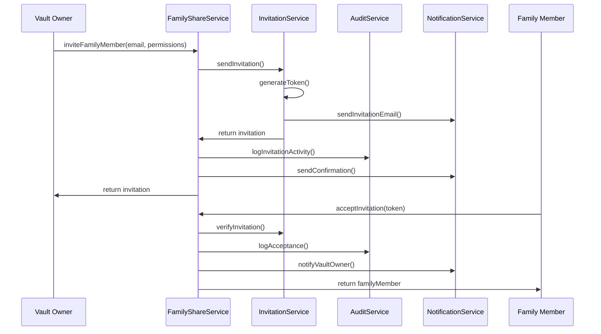
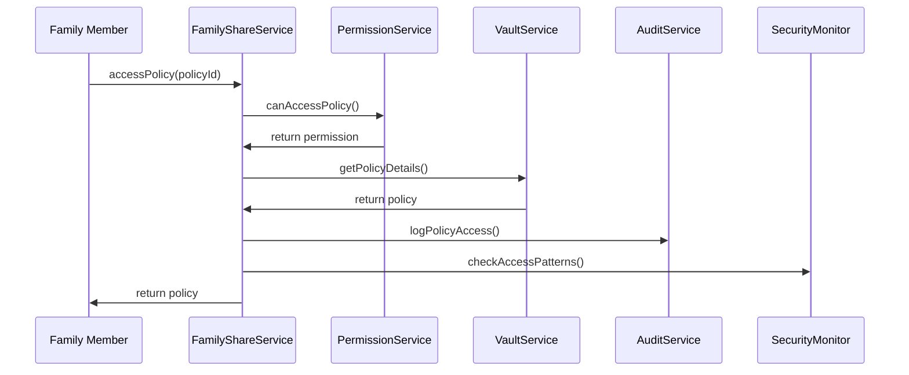
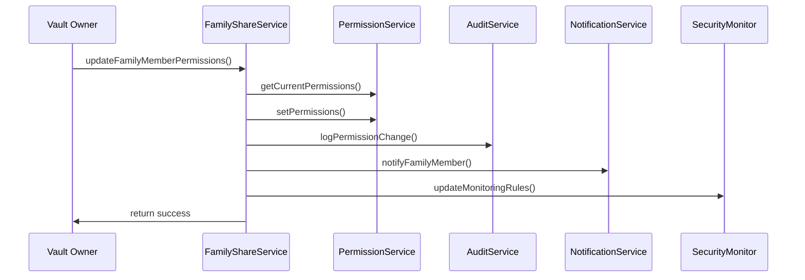

# Family Vault Sharing - Complete Integration Guide

## Overview

The Family Vault Sharing system is a comprehensive solution that enables InsureScan users to securely share their insurance policy vault with trusted family members. This document explains how all components work together to provide a complete, integrated experience.

## Architecture Overview

The system follows a layered architecture with clear separation of concerns:

```
┌─────────────────────────────────────────────────────────────┐
│                    Presentation Layer                        │
├─────────────────────────────────────────────────────────────┤
│  React Components  │  API Endpoints  │  React Hooks        │
├─────────────────────────────────────────────────────────────┤
│                    Integration Layer                         │
├─────────────────────────────────────────────────────────────┤
│           FamilyShareService (Main Orchestrator)            │
├─────────────────────────────────────────────────────────────┤
│                    Business Logic Layer                     │
├─────────────────────────────────────────────────────────────┤
│ Invitation │ Permission │ Vault │ Audit │ Security │ Dashboard│
│  Service   │  Service   │Service│Service│ Monitor  │ Service  │
├─────────────────────────────────────────────────────────────┤
│                      Data Layer                             │
├─────────────────────────────────────────────────────────────┤
│  Database  │ Email Service │ Crypto Service │ Notifications │
└─────────────────────────────────────────────────────────────┘
```

## Key Integration Points

### 1. Main Service Orchestrator

The `FamilyShareService` class serves as the main integration point:

```typescript
import { familyShareService } from '@/lib/family-sharing'

// Complete invitation workflow
const invitation = await familyShareService.inviteFamilyMember(
  vaultOwnerId,
  'family@example.com',
  'view_specific',
  ['policy-1', 'policy-2']
)
```

### 2. API Integration

The unified API endpoint provides access to all functionality:

```typescript
// GET /api/family-sharing?action=dashboard
// POST /api/family-sharing with { action: 'invite', email, permissions }
```

### 3. React Hook Integration

The `useFamilySharing` hook provides complete client-side integration:

```typescript
import { useFamilySharing } from '@/lib/family-sharing'

function FamilyDashboard() {
  const {
    dashboardData,
    familyMembers,
    inviteFamilyMember,
    updatePermissions,
    loading,
    error
  } = useFamilySharing()

  // Component logic here
}
```

## Complete Workflows

### 1. Family Member Invitation Workflow



### 2. Policy Access Workflow



### 3. Permission Update Workflow



## Service Dependencies

### Core Services
- **InvitationService**: Handles invitation creation, verification, and lifecycle
- **PermissionService**: Manages access control and permission enforcement
- **VaultService**: Provides read-only access to shared policies
- **AuditService**: Tracks all activities for security and compliance
- **SecurityMonitor**: Detects suspicious activities and manages alerts
- **DashboardService**: Aggregates data for dashboard display

### Utility Services
- **NotificationService**: Handles email notifications and alerts
- **PolicyFormatter**: Formats policy data for family member display
- **DatabaseUtils**: Provides database connectivity and utilities

### Configuration
- **FAMILY_SHARING_CONFIG**: System configuration constants
- **ERROR_MESSAGES**: Standardized error messages
- **Initialization**: System startup and health validation

## Usage Examples

### Basic Setup

```typescript
// 1. Initialize the system
import { initializeFamilySharing } from '@/lib/family-sharing'

const initResult = await initializeFamilySharing()
if (!initResult.success) {
  console.error('Initialization failed:', initResult.errors)
}
```

### Sending Invitations

```typescript
// 2. Send family member invitation
import { familyShareService } from '@/lib/family-sharing'

const invitation = await familyShareService.inviteFamilyMember(
  'vault-owner-id',
  'family@example.com',
  'view_specific',
  ['policy-1', 'policy-2'] // Specific policies to share
)
```

### Dashboard Integration

```typescript
// 3. Get dashboard data
const dashboardData = await familyShareService.getDashboardData('vault-owner-id')

console.log(`Family members: ${dashboardData.totalFamilyMembers}`)
console.log(`Pending invitations: ${dashboardData.pendingInvitations}`)
console.log(`Security alerts: ${dashboardData.securityAlerts}`)
```

### React Component Integration

```typescript
// 4. Use in React components
import { useFamilySharing } from '@/lib/family-sharing'

function FamilyManagement() {
  const {
    familyMembers,
    inviteFamilyMember,
    updatePermissions,
    revokeAccess,
    loading,
    error
  } = useFamilySharing()

  const handleInvite = async (email: string, permissions: string) => {
    const success = await inviteFamilyMember(email, permissions)
    if (success) {
      alert('Invitation sent successfully!')
    }
  }

  if (loading) return <div>Loading...</div>
  if (error) return <div>Error: {error}</div>

  return (
    <div>
      <h2>Family Members ({familyMembers.length})</h2>
      {familyMembers.map(member => (
        <div key={member.id}>
          <span>{member.email} - {member.permissions}</span>
          <button onClick={() => updatePermissions(member.id, 'view_all')}>
            Update Permissions
          </button>
          <button onClick={() => revokeAccess(member.id)}>
            Revoke Access
          </button>
        </div>
      ))}
    </div>
  )
}
```

## API Integration

### REST Endpoints

```typescript
// GET /api/family-sharing?action=dashboard
// Returns: Dashboard summary data

// GET /api/family-sharing?action=members  
// Returns: List of family members

// GET /api/family-sharing?action=audit
// Returns: Audit trail entries

// POST /api/family-sharing
// Body: { action: 'invite', email, permissions, specificPolicyIds? }
// Returns: Invitation details

// POST /api/family-sharing  
// Body: { action: 'updatePermissions', familyMemberId, newPermissions }
// Returns: Success confirmation
```

### Error Handling

```typescript
try {
  const result = await familyShareService.inviteFamilyMember(...)
} catch (error) {
  if (error.message.includes('Unauthorized')) {
    // Handle permission error
  } else if (error.message.includes('not found')) {
    // Handle not found error
  } else {
    // Handle general error
  }
}
```

## Testing Integration

### Unit Tests
Individual service tests are located in `services/__tests__/`

### Integration Tests
Complete system integration tests are in `__tests__/integration.test.ts`

### End-to-End Workflows
Workflow demonstrations are in `workflows/end-to-end-demo.ts`

### Running Tests

```bash
# Run all family sharing tests
npm test lib/family-sharing

# Run integration tests specifically
npm test lib/family-sharing/__tests__/integration.test.ts

# Run end-to-end workflow demonstration
npm run test:e2e:family-sharing
```

## Security Considerations

### Data Protection
- All family member access is read-only
- Sensitive data (SSN, account numbers) is filtered out
- Comprehensive audit logging of all activities

### Access Control
- Granular permission system (view all vs. view specific)
- Secure token-based invitation system
- Automatic session timeout and cleanup

### Monitoring
- Real-time security monitoring
- Suspicious activity detection
- Automated alerts for unusual patterns

## Performance Optimization

### Caching Strategy
- Dashboard data is cached for 5 minutes
- Policy data is cached per family member session
- Audit logs are paginated for large datasets

### Database Optimization
- Proper indexing on frequently queried fields
- Connection pooling for concurrent requests
- Optimized queries with selective field loading

### Monitoring
- Performance metrics collection
- Response time monitoring
- Error rate tracking

## Deployment Considerations

### Environment Variables
```bash
NEXT_PUBLIC_APP_URL=https://your-app.com
NEXTAUTH_SECRET=your-secret-key
NEXT_PUBLIC_SUPABASE_URL=your-supabase-url
NEXT_PUBLIC_SUPABASE_ANON_KEY=your-supabase-key
```

### Database Setup
1. Run migration: `supabase/migrations/20260220_create_family_sharing_tables.sql`
2. Verify table creation and permissions
3. Set up row-level security policies

### Health Monitoring
```typescript
// Check system health
const health = await validateSystemHealth()
if (!health.healthy) {
  console.error('System issues:', health.issues)
}
```

## Troubleshooting

### Common Issues

1. **Invitation emails not sending**
   - Check email service configuration
   - Verify SMTP settings
   - Check spam folders

2. **Permission errors**
   - Verify database permissions
   - Check row-level security policies
   - Validate user authentication

3. **Performance issues**
   - Check database connection pool
   - Monitor query performance
   - Review caching configuration

### Debug Mode
```typescript
// Enable debug logging
process.env.FAMILY_SHARING_DEBUG = 'true'

// Check service health
const healthResults = await familyShareService.healthCheck()
console.log('Service health:', healthResults)
```

## Future Enhancements

### Planned Features
- Mobile app integration
- Advanced permission templates
- Bulk operations for multiple family members
- Enhanced security monitoring with ML

### API Versioning
- Current version: v1
- Backward compatibility maintained
- Migration guides for major updates

## Support and Documentation

### Additional Resources
- API Documentation: `/docs/api/family-sharing`
- Database Schema: `/docs/database/family-sharing`
- Security Guide: `/docs/security/family-sharing`

### Getting Help
- Check the troubleshooting section above
- Review integration test examples
- Consult the end-to-end workflow demonstrations

This integration guide provides everything needed to understand, implement, and maintain the Family Vault Sharing system. All components work together seamlessly to provide a secure, reliable, and user-friendly experience for sharing insurance policy information with trusted family members.
